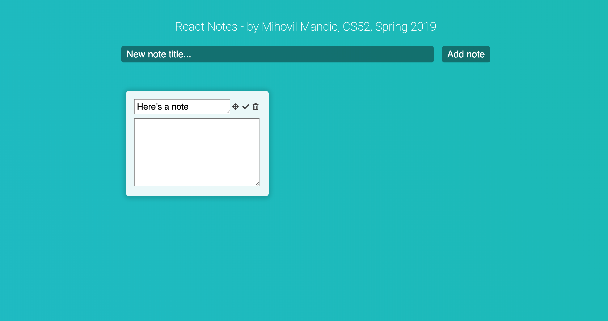
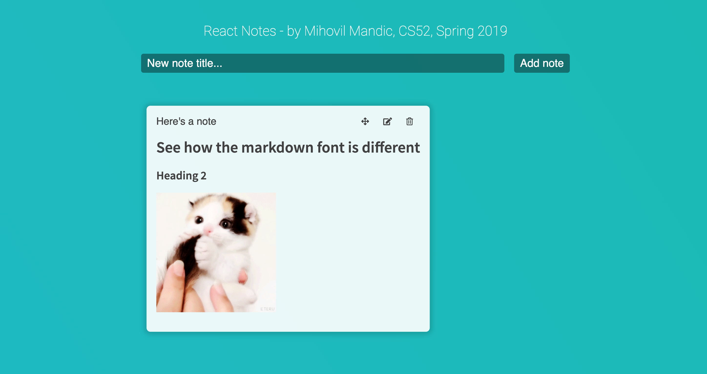
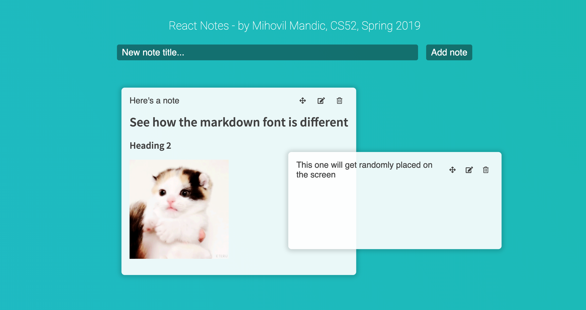
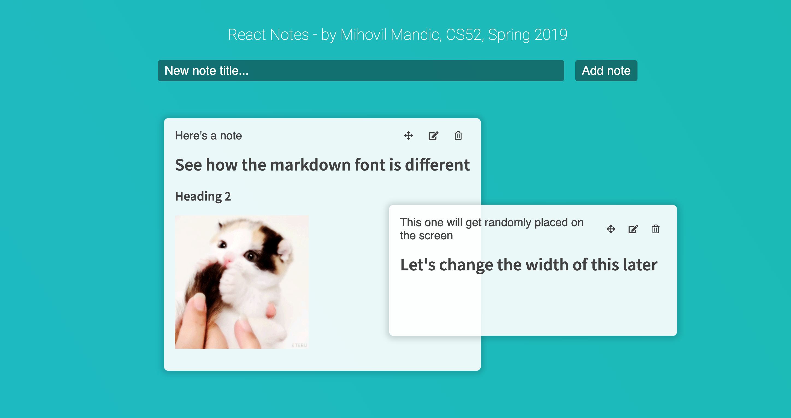
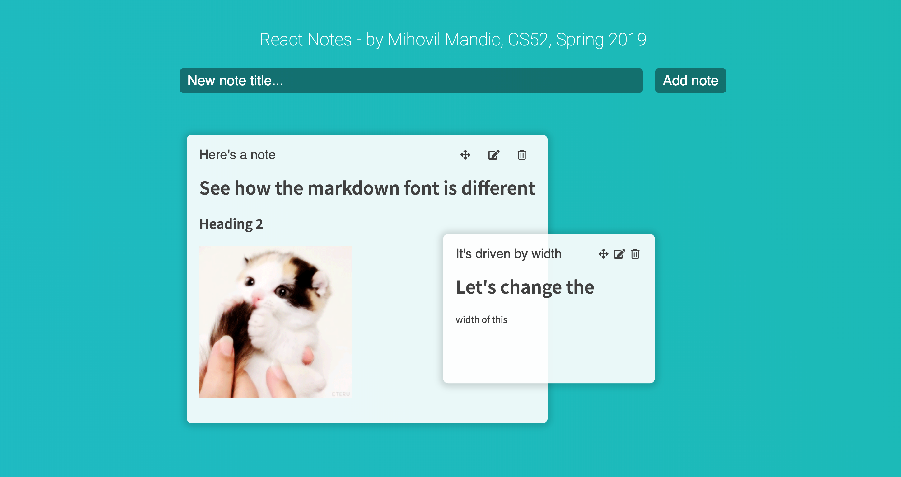
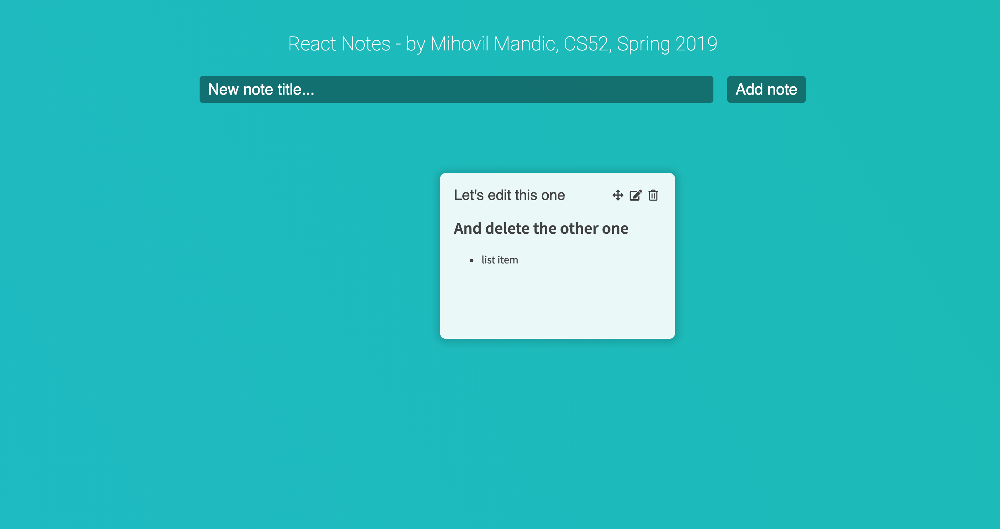

# React Notes
## by Mihovil Mandic for Lab 3, CS52, Spring 2019

The project is live [here](http://mihovilm-cs52-lab3.surge.sh)!

## What I did
I actually didn't realize how much time this lab would take, and I had to make sure I understand
SA4 completely before going through. After completing this lab, states etc. make much more sense to me.
I used FontAwesome, Google Fonts, and gradient-animator for designing this. 
I'm changing zIndexes to bring it to front whenever you click within a note.
The slack channel was very helpful. 

## What Worked / Didn't work
Everything from the minimal specs should work plus a bit more.
Migrating to firebase wasn't hard, but I struggled much more with local states etc. and was a bit devastated when I realized I'm gonna be changing add/update/delete methods all over again.

I'd like to thank the TA's for helping me with the export functions (modules) part in datastore.js
I'd also like to say that the hardest part is probably switching between states and props, or using callbacks from note.js to App.js through props.

## Extra Credit
It's pretty stylish? Haha. 
I implemented zIndex on clicking, dragging, and automatically setting the highest for the newest note. 
Expanding the textareas for title or content resizes the note. 
The zIndexing is done by iterating over the Map of objects and then finding the maximum zIndex. After that I just increase it on the one currently being dragged.
Also I'm randomizing the initial position of the notes between 40px and about 50% of the viewport height/width.

## Screenshots

